  

 

  
  
  
  
  

  <strong>AI-assisted products · Backend systems · Developer tooling · Engineering automation</strong>

##  Profile

I am **Nguyễn Thái Hảo** — also known as **KanzuWakazaki** — a software engineer based in Vietnam. I design and build AI-assisted platforms, backend services, interactive developer experiences, and full-stack products from early architecture through production delivery.

<table>
  <tr>
    <td width="33%" valign="top">
       <strong>Systems</strong>  
      APIs, service boundaries, data flows, reliability, security, and operational visibility.
    </td>
    <td width="33%" valign="top">
       <strong>Product</strong>  
      Usable interfaces, accessible workflows, measurable outcomes, and maintainable implementation.
    </td>
    <td width="34%" valign="top">
       <strong>Delivery</strong>  
      Reproducible environments, focused tests, CI/CD, reviewable automation, and clear documentation.
    </td>
  </tr>
</table>

  
  
  
  
  

##  Selected work

<table>
  <tr>
    <td width="50%" valign="top">
      <h3><a href="https://profile.hzi.io.vn/">Technical Portfolio </a></h3>
      
Engineering case studies presented with ownership, architecture, constraints, verification evidence, and outcomes.

      

        
        
        
      

      
<code>Next.js</code> <code>TypeScript</code> <code>React</code> <code>Playwright</code>

    </td>
    <td width="50%" valign="top">
      <h3><a href="https://github.com/KanzuXHorizon/HRS-code-public">Workforce Intelligence Platform </a></h3>
      
AI-assisted workforce operations spanning attendance, biometric verification, browser signals, agent orchestration, and an operations command center.

      

        
        
        
      

      
<code>.NET</code> <code>React</code> <code>TypeScript</code> <code>Python</code> <code>Redis</code>

    </td>
  </tr>
  <tr>
    <td width="50%" valign="top">
      <h3><a href="https://github.com/KanzuXHorizon/folderverse-3d">Folderverse 3D </a></h3>
      
A GPU-accelerated 3D file-system explorer with scalable layouts, clustering, level of detail, search, previews, and keyboard navigation.

      

        
        
        
      

      
<code>Next.js</code> <code>TypeScript</code> <code>React Three Fiber</code> <code>Three.js</code>

    </td>
    <td width="50%" valign="top">
      <h3><a href="https://github.com/KanzuXHorizon/Fca-Horizon-Remastered">FCA Horizon Remastered </a></h3>
      
An early Messenger automation API preserved as a transparent legacy case study, including its community impact and end-of-maintenance decision.

      

        
        
        
      

      
<code>JavaScript</code> <code>Node.js</code> <code>WebSocket</code> <code>Open Source</code>

    </td>
  </tr>
</table>

##  Engineering toolkit

<table>
  <tr>
    <td width="33%" valign="top">
      <strong>Languages</strong>  
      
      
      
      
      
    </td>
    <td width="33%" valign="top">
      <strong>Application</strong>  
      
      
      
      
      
      
    </td>
    <td width="34%" valign="top">
      <strong>Platform & delivery</strong>  
      
      
      
      
      
      
    </td>
  </tr>
</table>

##  Engineering snapshot

  

Generated in this repository from the GitHub GraphQL API. Private activity is represented only by GitHub's aggregate contribution count; private repository names and details are never rendered.

##  Working principles

<table>
  <tr>
    <td width="25%" valign="top"><strong>01 · Architecture</strong>  Clear boundaries, data flow, failure modes, and operational constraints before complexity.</td>
    <td width="25%" valign="top"><strong>02 · AI integration</strong>  Validation, guardrails, deterministic policy, explicit fallback, and human-reviewable outcomes.</td>
    <td width="25%" valign="top"><strong>03 · Quality</strong>  Focused tests, observable acceptance criteria, accessibility checks, and reproducible verification.</td>
    <td width="25%" valign="top"><strong>04 · Delivery</strong>  Least privilege, secret hygiene, reversible automation, and documentation that survives handoff.</td>
  </tr>
</table>

##  Contribution activity

  <picture>
    <source media="(prefers-color-scheme: dark)" srcset="https://raw.githubusercontent.com/KanzuXHorizon/KanzuXHorizon/output/github-contribution-grid-snake-dark.svg" />
    <source media="(prefers-color-scheme: light)" srcset="https://raw.githubusercontent.com/KanzuXHorizon/KanzuXHorizon/output/github-contribution-grid-snake.svg" />
    
  </picture>

  
<strong>Profile automation and quality controls</strong>

   

- <code>profile-metrics.yml</code> refreshes contributions, repository totals, language mix, latest public activity, commit count, and last-commit time every day.
- An optional <code>PROFILE_GITHUB_TOKEN</code> repository secret allows the workflow to refresh the private repository total; only the aggregate number is rendered. <code>PROFILE_PRIVATE_REPOSITORIES</code> is used as a safe fallback variable.
- <code>contribution-snake.yml</code> publishes theme-aware contribution animations to the <code>output</code> branch.
- <code>profile-quality.yml</code> validates JavaScript, SVG syntax, README references, and required local assets.
- Dependabot reviews GitHub Actions updates monthly.
- Third-party actions are pinned to immutable commit SHAs and use scoped repository permissions.

##  Connect

Detailed project evidence and case studies: **[profile.hzi.io.vn](https://profile.hzi.io.vn/)** 
Collaboration, project discussions, and engineering opportunities: **[ShinryuKanzu@hzi.io.vn](mailto:ShinryuKanzu@hzi.io.vn)**

 

  

